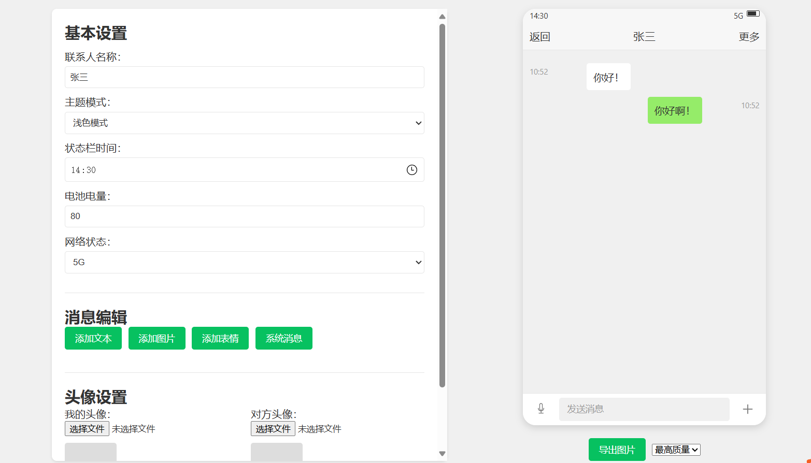
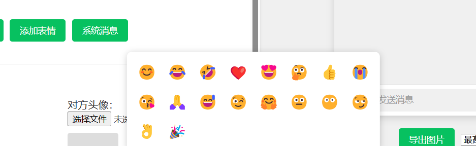

# 微信聊天记录导出工具

这是一个用于导出和查看微信聊天记录的 Web 工具。

## 功能特点

- 支持导出微信聊天记录
- 提供清晰的聊天界面展示
- 支持消息类型：文本、图片、语音等
- 响应式设计，适配各种设备

## 项目截图

### 基本设置界面

在这里你可以设置：
- 联系人信息
- 主题模式选择
- 状态栏时间
- 网络状态等

### 聊天界面展示

聊天界面特点：
- 简洁清晰的对话布局
- 支持表情显示
- 时间戳显示
- 发送状态提示


## 技术栈

- HTML5
- CSS3
- JavaScript

## 安装说明

1. 克隆仓库到本地：
```bash
git clone [你的仓库URL]
```

2. 直接在浏览器中打开 `index.html` 文件即可使用

## 使用方法

1. 打开网页应用
2. 按照界面提示导入微信聊天记录文件
3. 查看和浏览聊天记录

## 浏览器支持

- Chrome (推荐)
- Firefox
- Edge
- Safari

## 贡献指南

欢迎提交 Issues 和 Pull Requests 来帮助改进这个项目。

## 许可证

MIT License

## 联系方式

如有问题或建议，请通过 Issues 与我们联系。
邮件：1366522068@qq.com